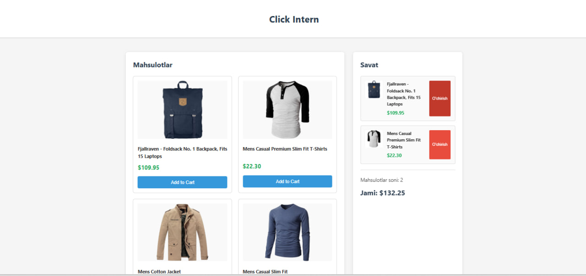
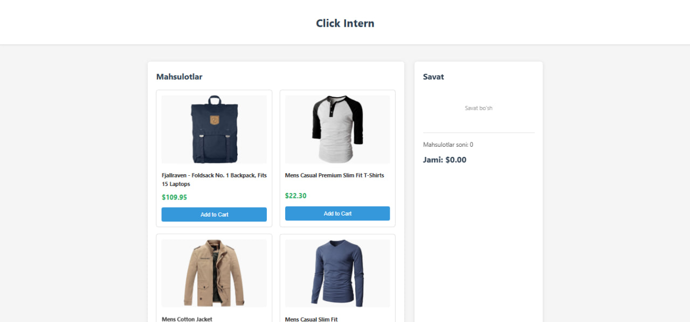
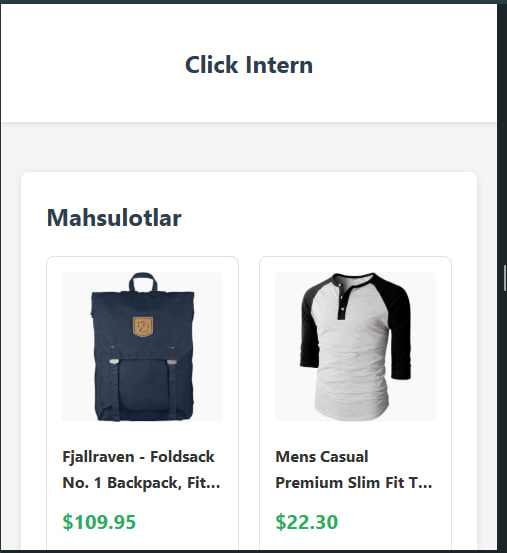
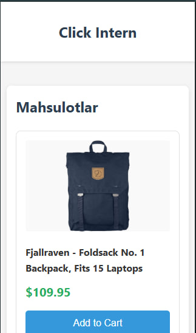

# Mini Marketplace

## Ism:
**Shoxruzbek Abduraxmonov Azizbek o'g'li**

## Vazifa qancha vaqt oldi: 
**40 Minut**

## Qiyin bo'lgan joylar:
**Vanilla JS va React o'rtasida ma'lumotlarni almashish biroz qiyin bo'ldi. window.addToCart funksiyasini global qilish kerak edi, boshida tushunmadim. localStorage dan ma'lumot o'qishda JSON.parse ishlatishni unutib qoldim, xatolik chiqdi keyin tuzatdim.**

## Interfeys skrinshotlari:

## Demo havolasi:
https://ashokhruzbek.github.io/click-intern **https://click-intern.vercel.app/**
